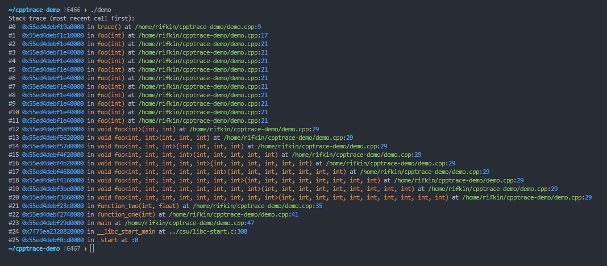

# Cpptrace

[](https://github.com/jeremy-rifkin/cpptrace/actions/workflows/build.yml)
[](https://github.com/jeremy-rifkin/cpptrace/actions/workflows/test.yml)
[](https://github.com/jeremy-rifkin/cpptrace/actions/workflows/lint.yml)
<br/>
[](https://github.com/jeremy-rifkin/cpptrace/actions/workflows/performance-tests.yml)
[](https://github.com/jeremy-rifkin/cpptrace/actions/workflows/cmake-integration.yml)
<br/>
[-Community%20Discord-blue?labelColor=2C3239&color=7289DA&style=flat&logo=discord&logoColor=959DA5)](https://discord.gg/7kv5AuCndG)

Cpptrace is a lightweight C++ stacktrace library supporting C++11 and greater on Linux, macOS, and Windows including
MinGW and Cygwin environments. The goal: Make stack traces simple for once.

Some day C++23's `<stacktrace>` will be ubiquitous. And maybe one day the msvc implementation will be acceptable.

This library is in beta, if you run into any problems please open an [issue][issue]!

[issue]: https://github.com/jeremy-rifkin/cpptrace/issues

## Table of Contents

- [Cpptrace](#cpptrace)
  - [Table of Contents](#table-of-contents)
  - [Quick Setup](#quick-setup)
  - [Other Installation Mechanisms](#other-installation-mechanisms)
    - [System-Wide Installation](#system-wide-installation)
    - [Package Managers](#package-managers)
  - [API](#api)
  - [Back-ends](#back-ends)
    - [Summary of Library Configurations](#summary-of-library-configurations)
  - [Testing Methodology](#testing-methodology)
  - [License](#license)

## Quick Setup

With CMake FetchContent:

```cmake
include(FetchContent)
FetchContent_Declare(
  cpptrace
  GIT_REPOSITORY https://github.com/jeremy-rifkin/cpptrace.git
  GIT_TAG        <HASH or TAG>
)
FetchContent_MakeAvailable(cpptrace)
target_link_libraries(your_target cpptrace)
```

It's as easy as that. Cpptrace will automatically configure itself for your system.

Be sure to configure with `-DCMAKE_BUILD_TYPE=Debug` or `-DDCMAKE_BUILD_TYPE=RelWithDebInfo` for symbols and line
information.



## Other Installation Mechanisms

### System-Wide Installation

```sh
git clone https://github.com/jeremy-rifkin/cpptrace.git
# optional: git checkout <HASH or TAG>
mkdir cpptrace/build
cd cpptrace/build
cmake .. -DCMAKE_BUILD_TYPE=Release -DBUILD_SHARED_LIBS=On
make -j
sudo make install
```

Using through cmake:
```cmake
find_package(cpptrace REQUIRED)
target_link_libraries(<your target> cpptrace::cpptrace)
```
Be sure to configure with `-DCMAKE_BUILD_TYPE=Debug` or `-DDCMAKE_BUILD_TYPE=RelWithDebInfo` for symbols and line
information.

Or compile with `-lcpptrace`:

```sh
g++ main.cpp -o main -g -Wall -lcpptrace
./main
```

If you get an error along the lines of
```
error while loading shared libraries: libcpptrace.so: cannot open shared object file: No such file or directory
```
You may have to run `sudo /sbin/ldconfig` to create any necessary links and update caches so the system can find
libcpptrace.so (I had to do this on Ubuntu). Only when installing system-wide. Usually your package manger does this for
you when installing new libraries.

<details>
    <summary>System-wide install on windows</summary>

```ps1
git clone https://github.com/jeremy-rifkin/cpptrace.git
# optional: git checkout <HASH or TAG>
mkdir cpptrace/build
cd cpptrace/build
cmake .. -DCMAKE_BUILD_TYPE=Release
msbuild cpptrace.sln
msbuild INSTALL.vcxproj
```

Note: You'll need to run as an administrator in a developer powershell, or use vcvarsall.bat distributed with visual
studio to get the correct environment variables set.
</details>

### Local User Installation

To install just for the local user (or any custom prefix):

```sh
git clone https://github.com/jeremy-rifkin/cpptrace.git
# optional: git checkout <HASH or TAG>
mkdir cpptrace/build
cd cpptrace/build
cmake .. -DCMAKE_BUILD_TYPE=Release -DBUILD_SHARED_LIBS=On -DCMAKE_INSTALL_PREFIX=$HOME/wherever
make -j
sudo make install
```

Using through cmake:
```cmake
find_package(cpptrace REQUIRED PATHS $ENV{HOME}/wherever)
target_link_libraries(<your target> cpptrace::cpptrace)
```

Using manually:
```
g++ main.cpp -o main -g -Wall -I$HOME/wherever/include -L$HOME/wherever/lib -lcpptrace
```

### Package Managers

Coming soon

## API

`cpptrace::print_trace()` can be used to print a stacktrace at the current call site, `cpptrace::generate_trace()` can
be used to get raw frame information for custom use.

**Note:** Debug info (`-g`) is generally required for good trace information. Some back-ends read symbols from dynamic
export information which may require `-rdynamic` or manually marking symbols for exporting.

```cpp
namespace cpptrace {
    struct stacktrace_frame {
        uintptr_t address;
        std::uint_least32_t line;
        std::uint_least32_t col;
        std::string filename;
        std::string symbol;
    };
    std::vector<stacktrace_frame> generate_trace(std::uint32_t skip = 0);
    void print_trace(std::uint32_t skip = 0);
}
```

## Back-ends

Back-end libraries are required for unwinding the stack and resolving symbol information (name and source location) in
order to generate a stacktrace.

The CMake script attempts to automatically choose good back-ends based on what is available on your system. You can
also manually set which back-end you want used.

**Unwinding**

| Library       | CMake config                    | Platforms           | Info                                                                                                                                                                                                     |
| ------------- | ------------------------------- | ------------------- | -------------------------------------------------------------------------------------------------------------------------------------------------------------------------------------------------------- |
| libgcc unwind | `CPPTRACE_UNWIND_WITH_UNWIND`   | linux, macos, mingw | Frames are captured with libgcc's `_Unwind_Backtrace`, which currently produces the most accurate stack traces on gcc/clang/mingw. Libgcc is often linked by default, and llvm has something equivalent. |
| execinfo.h    | `CPPTRACE_UNWIND_WITH_EXECINFO` | linux, macos        | Frames are captured with `execinfo.h`'s `backtrace`, part of libc on linux/unix systems.                                                                                                                 |
| winapi        | `CPPTRACE_UNWIND_WITH_WINAPI`   | windows, mingw      | Frames are captured with `CaptureStackBackTrace`.                                                                                                                                                        |
| N/A           | `CPPTRACE_UNWIND_WITH_NOTHING`  | all                 | Unwinding is not done, stack traces will be empty.                                                                                                                                                       |

These back-ends require a fixed buffer has to be created to read addresses into while unwinding. By default the buffer
can hold addresses for 100 frames (beyond the `skip` frames). This is configurable with `CPPTRACE_HARD_MAX_FRAMES`.

**Symbol resolution**

| Library      | CMake config                             | Platforms             | Info                                                                                                                                                                                         |
| ------------ | ---------------------------------------- | --------------------- | -------------------------------------------------------------------------------------------------------------------------------------------------------------------------------------------- |
| libbacktrace | `CPPTRACE_GET_SYMBOLS_WITH_LIBBACKTRACE` | linux, macos*, mingw* | Libbacktrace is already installed on most systems or available through the compiler directly. For clang you must specify the absolute path to `backtrace.h` using `CPPTRACE_BACKTRACE_PATH`. |
| addr2line    | `CPPTRACE_GET_SYMBOLS_WITH_ADDR2LINE`    | linux, macos, mingw   | Symbols are resolved by invoking `addr2line` (or `atos` on mac) via `fork()` (on linux/unix, and `popen` under mingw).                                                                       |
| dbghelp      | `CPPTRACE_GET_SYMBOLS_WITH_DBGHELP`      | windows               | Dbghelp.h allows access to symbols via debug info.                                                                                                                                           |
| libdl        | `CPPTRACE_GET_SYMBOLS_WITH_LIBDL`        | linux, macos          | Libdl uses dynamic export information. Compiling with `-rdynamic` is needed for symbol information to be retrievable. Line numbers won't be retrievable.                                     |
| N/A          | `CPPTRACE_GET_SYMBOLS_WITH_NOTHING`      | all                   | No attempt is made to resolve symbols.                                                                                                                                                       |

*: Requires installation

Note for addr2line: By default cmake will resolve an absolute path to addr2line to bake into the library. This path can
be configured with `CPPTRACE_ADDR2LINE_PATH`, or `CPPTRACE_ADDR2LINE_SEARCH_SYSTEM_PATH` can be used to have the library
search the system path for `addr2line` at runtime. This is not the default to prevent against path injection attacks.

**Demangling**

Lastly, depending on other back-ends used a demangler back-end may be needed. A demangler back-end is not needed when
doing full traces with libbacktrace, getting symbols with addr2line, or getting symbols with dbghelp.

| Library  | CMake config                     | Platforms           | Info                                                                               |
| -------- | -------------------------------- | ------------------- | ---------------------------------------------------------------------------------- |
| cxxabi.h | `CPPTRACE_DEMANGLE_WITH_CXXABI`  | Linux, macos, mingw | Should be available everywhere other than [msvc](https://godbolt.org/z/93ca9rcdz). |
| N/A      | `CPPTRACE_DEMANGLE_WITH_NOTHING` | all                 | Don't attempt to do anything beyond what the symbol resolution back-end does.      |

**Full tracing**

Libbacktrace can generate a full stack trace itself, both unwinding and resolving symbols. This can be chosen with
`CPPTRACE_FULL_TRACE_WITH_LIBBACKTRACE`. The auto config attempts to use this if it is available. Full tracing with
libbacktrace ignores `CPPTRACE_HARD_MAX_FRAMES`.

`<stacktrace>` can of course also generate a full trace, if you're using >=C++23 and your compiler supports it. This is
controlled by `CPPTRACE_FULL_TRACE_WITH_LIBBACKTRACE`. The cmake script will attempt to auto configure to this if
possible. `CPPTRACE_HARD_MAX_FRAMES` is ignored.

**More?**

There are plenty more libraries that can be used for unwinding, parsing debug information, and demangling. In the future
more back-ends can be added. Ideally this library can "just work" on systems, without additional installation work.

### Summary of Library Configurations

Summary of all library configuration options:

Back-ends:
- `CPPTRACE_FULL_TRACE_WITH_LIBBACKTRACE=On/Off`
- `CPPTRACE_FULL_TRACE_WITH_STACKTRACE=On/Off`
- `CPPTRACE_GET_SYMBOLS_WITH_LIBBACKTRACE=On/Off`
- `CPPTRACE_GET_SYMBOLS_WITH_LIBDL=On/Off`
- `CPPTRACE_GET_SYMBOLS_WITH_ADDR2LINE=On/Off`
- `CPPTRACE_GET_SYMBOLS_WITH_DBGHELP=On/Off`
- `CPPTRACE_GET_SYMBOLS_WITH_NOTHING=On/Off`
- `CPPTRACE_UNWIND_WITH_UNWIND=On/Off`
- `CPPTRACE_UNWIND_WITH_EXECINFO=On/Off`
- `CPPTRACE_UNWIND_WITH_WINAPI=On/Off`
- `CPPTRACE_UNWIND_WITH_NOTHING=On/Off`
- `CPPTRACE_DEMANGLE_WITH_CXXABI=On/Off`
- `CPPTRACE_DEMANGLE_WITH_NOTHING=On/Off`

Back-end configuration:
- `CPPTRACE_BACKTRACE_PATH=<string>`: Path to libbacktrace backtrace.h, needed when compiling with clang
- `CPPTRACE_HARD_MAX_FRAMES=<number>`: Some back-ends write to a fixed-size buffer. This is the size of that buffer.
  Default is `100`.
- `CPPTRACE_ADDR2LINE_PATH=<string>`: Specify the absolute path to the addr2line binary for cpptrace to invoke. By
  default the config script will search for a binary and use that absolute path (this is to prevent against path
  injection).
- `CPPTRACE_ADDR2LINE_SEARCH_SYSTEM_PATH=On/Off`: Specifies whether cpptrace should let the system search the PATH
  environment variable directories for the binary.

Testing:
- `CPPTRACE_BUILD_TEST` Build a small test program
- `CPPTRACE_BUILD_DEMO` Build a small demo program
- `CPPTRACE_BUILD_TEST_RDYNAMIC` Use `-rdynamic` when compiling the test program
- `CPPTRACE_BUILD_SPEEDTEST` Build a small speed test program
- `CPPTRACE_BUILD_SPEEDTEST_DWARF4`
- `CPPTRACE_BUILD_SPEEDTEST_DWARF5`

## Testing Methodology

Cpptrace currently uses integration and functional testing, building and running under every combination of back-end
options. The implementation is based on [github actions matrices][1] and driven by python scripts located in the
[`ci/`](ci/) folder. Testing used to be done by github actions matrices directly, however, launching hundreds of two
second jobs was extremely inefficient. Test outputs are compared against expected outputs located in
[`test/expected/`](test/expected/). Stack trace addresses may point to the address after an instruction depending on the
unwinding back-end, and the python script will check for an exact or near-match accordingly.

[1]: https://docs.github.com/en/actions/using-jobs/using-a-matrix-for-your-jobs

## License

The library is under the MIT license.
