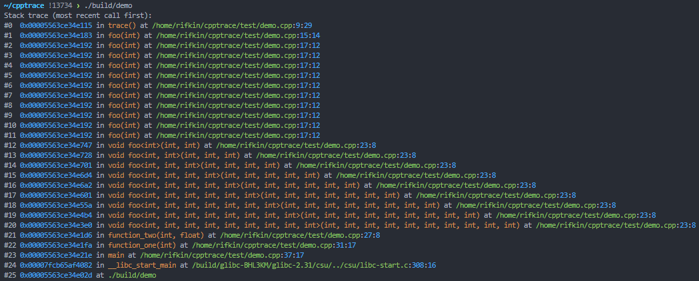
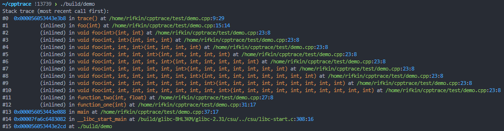

# Cpptrace <!-- omit in toc -->

[](https://github.com/jeremy-rifkin/cpptrace/actions/workflows/build.yml)
[](https://github.com/jeremy-rifkin/cpptrace/actions/workflows/test.yml)
[](https://sonarcloud.io/summary/new_code?id=jeremy-rifkin_cpptrace)
<br/>
[-Community%20Discord-blue?labelColor=2C3239&color=7289DA&style=flat&logo=discord&logoColor=959DA5)](https://discord.gg/frjaAZvqUZ)
<br/>
[](https://godbolt.org/z/c6TqTzqcf)

Cpptrace is a simple, portable, and self-contained C++ stacktrace library supporting C++11 and greater on Linux, macOS,
and Windows including MinGW and Cygwin environments. The goal: Make stack traces simple for once.

Cpptrace also has a C API, docs [here](docs/c-api.md).

## Table of Contents <!-- omit in toc -->

- [30-Second Overview](#30-second-overview)
  - [CMake FetchContent Usage](#cmake-fetchcontent-usage)
- [FAQ](#faq)
  - [What about C++23 `<stacktrace>`?](#what-about-c23-stacktrace)
  - [What does cpptrace have over other C++ stacktrace libraries?](#what-does-cpptrace-have-over-other-c-stacktrace-libraries)
- [In-Depth Documentation](#in-depth-documentation)
  - [Prerequisites](#prerequisites)
  - [`namespace cpptrace`](#namespace-cpptrace)
    - [Stack Traces](#stack-traces)
    - [Object Traces](#object-traces)
    - [Raw Traces](#raw-traces)
    - [Utilities](#utilities)
    - [Configuration](#configuration)
    - [Traced Exceptions](#traced-exceptions)
  - [Wrapping std::exceptions](#wrapping-stdexceptions)
  - [Exception handling with cpptrace](#exception-handling-with-cpptrace)
  - [Signal-Safe Tracing](#signal-safe-tracing)
  - [Utility Types](#utility-types)
- [Supported Debug Formats](#supported-debug-formats)
- [Usage](#usage)
  - [CMake FetchContent](#cmake-fetchcontent)
  - [System-Wide Installation](#system-wide-installation)
  - [Local User Installation](#local-user-installation)
  - [Use Without CMake](#use-without-cmake)
  - [Installation Without Package Managers or FetchContent](#installation-without-package-managers-or-fetchcontent)
  - [Package Managers](#package-managers)
    - [Conan](#conan)
    - [Vcpkg](#vcpkg)
- [Platform Logistics](#platform-logistics)
  - [Windows](#windows)
  - [macOS](#macos)
- [Library Back-Ends](#library-back-ends)
  - [Summary of Library Configurations](#summary-of-library-configurations)
- [Testing Methodology](#testing-methodology)
- [Notes About the Library and Future Work](#notes-about-the-library-and-future-work)
- [License](#license)

# 30-Second Overview

Generating stack traces is as easy as:

```cpp
#include <cpptrace/cpptrace.hpp>

void trace() {
    cpptrace::generate_trace().print();
}
```



Cpptrace can also retrieve function inlining information on optimized release builds:



Cpptrace provides access to resolved stack traces as well as lightweight raw traces (just addresses) that can be
resolved later:

```cpp
const auto raw_trace = cpptrace::generate_raw_trace();
// then later
raw_trace.resolve().print();
```

Cpptrace also provides exception types that store stack traces:
```cpp
#include <cpptrace/cpptrace.hpp>

void trace() {
    throw cpptrace::logic_error("This wasn't supposed to happen!");
}
```


Additional notable features:

- Utilities for demangling
- Utilities for catching `std::exception`s and wrapping them in traced exceptions
- Signal-safe stack tracing
- Source code snippets in traces


## CMake FetchContent Usage

```cmake
include(FetchContent)
FetchContent_Declare(
  cpptrace
  GIT_REPOSITORY https://github.com/jeremy-rifkin/cpptrace.git
  GIT_TAG        v0.5.4 # <HASH or TAG>
)
FetchContent_MakeAvailable(cpptrace)
target_link_libraries(your_target cpptrace::cpptrace)

# On windows copy cpptrace.dll to the same directory as the executable for your_target
if(WIN32)
  add_custom_command(
    TARGET your_target POST_BUILD
    COMMAND ${CMAKE_COMMAND} -E copy_if_different
    $<TARGET_FILE:cpptrace::cpptrace>
    $<TARGET_FILE_DIR:your_target>
  )
endif()
```

Be sure to configure with `-DCMAKE_BUILD_TYPE=Debug` or `-DDCMAKE_BUILD_TYPE=RelWithDebInfo` for symbols and line
information.

On macOS it is recommended to generate a `.dSYM` file, see [Platform Logistics](#platform-logistics) below.

For other ways to use the library, such as through package managers, a system-wide installation, or on a platform
without internet access see [Usage](#usage) below.

# FAQ

## What about C++23 `<stacktrace>`?

Some day C++23's `<stacktrace>` will be ubiquitous. And maybe one day the msvc implementation will be acceptable.
The original motivation for cpptrace was to support projects using older C++ standards and as the library has grown its
functionality has extended beyond the standard library's implementation.

Cpptrace provides functionality beyond what the standard library provides and what implementations provide, such as:
- Walking inlined function calls
- Providing a lightweight interface for "raw traces"
- Resolving function parameter types
- Providing traced exception objects
- Providing an API for signal-safe stacktrace generation

## What does cpptrace have over other C++ stacktrace libraries?

Other C++ stacktrace libraries, such as boost stacktrace and backward-cpp, fall short when it comes to portability and
ease of use. In testing, I found neither to provide adaquate coverage of various environments. Even when they can be
made to work in an environment they require manual configuration from the end-user, possibly requiring manual
installation of third-party dependencies. This is a highly undesirable burden to impose on users, especially when it is
for a software package which just provides diagnostics as opposed to core functionality. Additionally, cpptrace provides
support for resolving inlined calls by default for DWARF symbols (boost does not do this, backward-cpp can do this but
only for some back-ends), better support for resolving full function signatures, and nicer API, among other features.

# In-Depth Documentation

## Prerequisites

> [!IMPORTANT]
> Debug info (`-g`/`/Z7`/`/Zi`/`/DEBUG`/`-DBUILD_TYPE=Debug`/`-DBUILD_TYPE=RelWithDebInfo`) is required for complete
> trace information.

## `namespace cpptrace`

`cpptrace::generate_trace()` can be used to generate a stacktrace object at the current call site. Resolved frames can
be accessed from this object with `.frames` and also the trace can be printed with `.print()`. Cpptrace also provides a
method to get lightweight raw traces, which are just vectors of program counters, which can be resolved at a later time.

All functions are thread-safe unless otherwise noted.

### Stack Traces

The core resolved stack trace object. Generate a trace with `cpptrace::generate_trace()` or
`cpptrace::stacktrace::current()`. On top of a set of helper functions `struct stacktrace` allows
direct access to frames as well as iterators.

`cpptrace::stacktrace::print` can be used to print a stacktrace. `cpptrace::stacktrace::print_with_snippets` can be used
to print a stack trace with source code snippets.

```cpp
namespace cpptrace {
    // Some type sufficient for an instruction pointer, currently always an alias to std::uintptr_t
    using frame_ptr = std::uintptr_t;

    struct stacktrace_frame {
        frame_ptr raw_address; // address in memory
        frame_ptr object_address; // address in the object file
        // nullable<T> represents a nullable integer. More docs later.
        nullable<std::uint32_t> line;
        nullable<std::uint32_t> column;
        std::string filename;
        std::string symbol;
        bool is_inline;
        bool operator==(const stacktrace_frame& other) const;
        bool operator!=(const stacktrace_frame& other) const;
        object_frame get_object_info() const; // object_address is stored but if the object_path is needed this can be used
        std::string to_string() const;
        /* operator<<(ostream, ..) and std::format support exist for this object */
    };

    struct stacktrace {
        std::vector<stacktrace_frame> frames;
        // here as a drop-in for std::stacktrace
        static stacktrace current(std::size_t skip = 0);
        static stacktrace current(std::size_t skip, std::size_t max_depth);
        void print() const;
        void print(std::ostream& stream) const;
        void print(std::ostream& stream, bool color) const;
        void print_with_snippets() const;
        void print_with_snippets(std::ostream& stream) const;
        void print_with_snippets(std::ostream& stream, bool color) const;
        std::string to_string(bool color = false) const;
        void clear();
        bool empty() const noexcept;
        /* operator<<(ostream, ..), std::format support, and iterators exist for this object */
    };

    stacktrace generate_trace(std::size_t skip = 0);
    stacktrace generate_trace(std::size_t skip, std::size_t max_depth);
}
```

### Object Traces

Object traces contain the most basic information needed to construct a stack trace outside the currently running
executable. It contains the raw address, the address in the binary (ASLR and the object file's memory space and whatnot
is resolved), and the path to the object the instruction pointer is located in.

```cpp
namespace cpptrace {
    struct object_frame {
        std::string object_path;
        frame_ptr raw_address;
        frame_ptr object_address;
    };

    struct object_trace {
        std::vector<object_frame> frames;
        static object_trace current(std::size_t skip = 0);
        static object_trace current(std::size_t skip, std::size_t max_depth);
        stacktrace resolve() const;
        void clear();
        bool empty() const noexcept;
        /* iterators exist for this object */
    };

    object_trace generate_object_trace(std::size_t skip = 0);
    object_trace generate_object_trace(std::size_t skip, std::size_t max_depth);
}
```

### Raw Traces

Raw trace access: A vector of program counters. These are ideal for fast and cheap traces you want to resolve later.

Note it is important executables and shared libraries in memory aren't somehow unmapped otherwise libdl calls (and
`GetModuleFileName` in windows) will fail to figure out where the program counter corresponds to.

```cpp
namespace cpptrace {
    struct raw_trace {
        std::vector<frame_ptr> frames;
        static raw_trace current(std::size_t skip = 0);
        static raw_trace current(std::size_t skip, std::size_t max_depth);
        object_trace resolve_object_trace() const;
        stacktrace resolve() const;
        void clear();
        bool empty() const noexcept;
        /* iterators exist for this object */
    };

    raw_trace generate_raw_trace(std::size_t skip = 0);
    raw_trace generate_raw_trace(std::size_t skip, std::size_t max_depth);
}
```

### Utilities

`cpptrace::demangle` provides a helper function for name demangling, since it has to implement that helper internally
anyways.

`cpptrace::get_snippet` gets a text snippet, if possible, from for the given source file for +/- `context_size` lines
around `line`.

`cpptrace::isatty` and the fileno definitions are useful for deciding whether to use color when printing stack traces.

`cpptrace::register_terminate_handler()` is a helper function to set a custom `std::terminate` handler that prints a
stack trace from a cpptrace exception (more info below) and otherwise behaves like the normal terminate handler.

```cpp
namespace cpptrace {
    std::string demangle(const std::string& name);
    std::string get_snippet(
        const std::string& path,
        std::size_t line,
        std::size_t context_size,
        bool color = false
    );
    bool isatty(int fd);

    extern const int stdin_fileno;
    extern const int stderr_fileno;
    extern const int stdout_fileno;

    void register_terminate_handler();
}
```

### Configuration

`cpptrace::absorb_trace_exceptions`: Configure whether the library silently absorbs internal exceptions and continues.
Default is true.

`cpptrace::ctrace_enable_inlined_call_resolution`: Configure whether the library will attempt to resolve inlined call
information for release builds. Default is true.

`cpptrace::experimental::set_cache_mode`: Control time-memory tradeoffs within the library. By default speed is
prioritized. If using this function, set the cache mode at the very start of your program before any traces are
performed.

```cpp
namespace cpptrace {
    void absorb_trace_exceptions(bool absorb);
    void ctrace_enable_inlined_call_resolution(bool enable);

    enum class cache_mode {
        // Only minimal lookup tables
        prioritize_memory,
        // Build lookup tables but don't keep them around between trace calls
        hybrid,
        // Build lookup tables as needed
        prioritize_speed
    };

    namespace experimental {
        void set_cache_mode(cache_mode mode);
    }
}
```

### Traced Exceptions

Cpptrace provides an interface for a traced exceptions, `cpptrace::exception`, as well as a set of exception classes
that that generate stack traces when thrown. These exceptions generate relatively lightweight raw traces and resolve
symbols and line numbers lazily if and when requested.

The basic interface is:
```cpp
namespace cpptrace {
    class exception : public std::exception {
    public:
        virtual const char* what() const noexcept = 0; // The what string both the message and trace
        virtual const char* message() const noexcept = 0;
        virtual const stacktrace& trace() const noexcept = 0;
    };
}
```

There are two ways to go about traced exception objects: Traces can be resolved eagerly or lazily. Cpptrace provides the
basic implementation of exceptions as lazy exceptions. I hate to have anything about the implementation exposed in the
interface or type system but this seems to be the best way to do this.

```cpp
namespace cpptrace {
    class lazy_exception : public exception {
        // lazy_trace_holder is basically a std::variant<raw_trace, stacktrace>, more docs later
        mutable detail::lazy_trace_holder trace_holder;
        mutable std::string what_string;
    public:
        explicit lazy_exception(
            raw_trace&& trace = detail::get_raw_trace_and_absorb()
        ) noexcept : trace_holder(std::move(trace)) {}
        const char* what() const noexcept override;
        const char* message() const noexcept override;
        const stacktrace& trace() const noexcept override;
    };
}
```

`cpptrace::lazy_exception` can be freely thrown or overridden. Generally `message()` is the only field to override.

Lastly cpptrace provides an exception class that takes a user-provided message, `cpptrace::exception_with_message`, as
well as a number of traced exception classes resembling `<stdexcept>`:

```cpp
namespace cpptrace {
    class exception_with_message : public lazy_exception {
        mutable std::string user_message;
    public:
        explicit exception_with_message(
            std::string&& message_arg,
            raw_trace&& trace = detail::get_raw_trace_and_absorb()
        ) noexcept : lazy_exception(std::move(trace)), user_message(std::move(message_arg)) {}
        const char* message() const noexcept override;
    };

    // All stdexcept errors have analogs here. All have the constructor:
    // explicit the_error(
    //     std::string&& message_arg,
    //     raw_trace&& trace = detail::get_raw_trace_and_absorb()
    // ) noexcept
    //     : exception_with_message(std::move(message_arg), std::move(trace)) {}
    class logic_error      : public exception_with_message { ... };
    class domain_error     : public exception_with_message { ... };
    class invalid_argument : public exception_with_message { ... };
    class length_error     : public exception_with_message { ... };
    class out_of_range     : public exception_with_message { ... };
    class runtime_error    : public exception_with_message { ... };
    class range_error      : public exception_with_message { ... };
    class overflow_error   : public exception_with_message { ... };
    class underflow_error  : public exception_with_message { ... };
}
```

## Wrapping std::exceptions

Cpptrace exceptions can provide great information for user-controlled exceptions. For non-cpptrace::exceptions that may
originate outside of code you control, e.g. the standard library, cpptrace provides some wrapper utilities that can
rethrow these exceptions nested in traced cpptrace exceptions. The trace won't be perfect, the trace will start where
the rapper caught it, but these utilities can provide good diagnostic information. Unfortunately this is the best
solution for this problem, as far as I know.

```cpp
std::vector<int> foo = {1, 2, 3};
CPPTRACE_WRAP_BLOCK(
    foo.at(4) = 2;
    foo.at(5)++;
);
std::cout<<CPPTRACE_WRAP(foo.at(12))<<std::endl;
```

## Exception handling with cpptrace

Working with cpptrace exceptions in your code:
```cpp
try {
    foo();
} catch(cpptrace::exception& e) {
    // Prints the exception info and stack trace, conditionally enabling color codes depending on
    // whether stderr is a terminal
    std::cerr << "Error: " << e.message() << '\n';
    e.trace().print(std::cerr, cpptrace::isatty(cpptrace::stderr_fileno));
} catch(std::exception& e) {
    std::cerr << "Error: " << e.what() << '\n';
}
```

Additionally cpptrace provides a custom `std::terminate` handler that prints a stack trace from a cpptrace exception and otherwise behaves like the normal terminate handler and prints the stack trace involved in reaching `std::terminate`.
The stack trace to `std::terminate` may be helpful or it may not, it depends on the implementation, but often if an
implementation can't find an appropriate `catch` while unwinding it will jump directly to `std::terminate` giving
good information.

To register this custom handler:

```cpp
cpptrace::register_terminate_handler();
```

## Signal-Safe Tracing

Signal-safe stack tracing is very useful for debugging application crashes, e.g. SIGSEGVs or
SIGTRAPs, but it's very difficult to do correctly and most implementations I see online do this
incorrectly.

In order to do this full process safely the way to go is collecting basic information in the signal
handler and then either resolving later or handing that information to another process to resolve.

It's not as simple as calling `cpptrace::generate_trace().print()`, though you might be able to get
away with that, but this is what is needed to really do this safely.

The safe API is as follows:

```cpp
namespace cpptrace {
    std::size_t safe_generate_raw_trace(frame_ptr* buffer, std::size_t size, std::size_t skip = 0);
    std::size_t safe_generate_raw_trace(frame_ptr* buffer, std::size_t size, std::size_t skip, std::size_t max_depth);
    struct safe_object_frame {
        frame_ptr raw_address;
        frame_ptr address_relative_to_object_start; // object base address must yet be added
        char object_path[CPPTRACE_PATH_MAX + 1];
        object_frame resolve() const; // To be called outside a signal handler. Not signal safe.
    };
    void get_safe_object_frame(frame_ptr address, safe_object_frame* out);
    bool can_signal_safe_unwind();
}
```

> [!IMPORTANT]
> Currently signal-safe stack unwinding is only possible with `libunwind`, which must be
> [manually enabled](#library-back-ends). If signal-safe unwinding isn't supported, `safe_generate_raw_trace` will just
> produce an empty trace. `can_signal_safe_unwind` can be used to check for signal-safe unwinding support. If object
> information can't be resolved in a signal-safe way then `get_safe_object_frame` will not populate fields beyond the
> `raw_address`.

> [!CAUTION]
> Calls to shared objects can be lazy-loaded where the first call to the shared object invokes non-signal-safe functions
> such as `malloc()`. To avoid this, call these routines in `main()` ahead of a signal handler to "warm up" the library.

Because signal-safe tracing is an involved process, I have written up a comprehensive overview of
what is involved at [signal-safe-tracing.md](docs/signal-safe-tracing.md).

## Utility Types

A couple utility types are used to provide the library with a good interface.

`nullable<T>` is used for a nullable integer type. Internally the maximum value for `T` is used as a
sentinel. `std::optional` would be used if this library weren't c++11. But, `nullable<T>` provides
an `std::optional`-like interface and it's less heavy-duty for this use than an `std::optional`.

`detail::lazy_trace_holder` is a utility type for `lazy_exception` used in place of an
`std::variant<raw_trace, stacktrace>`.

```cpp
namespace cpptrace {
    template<typename T, typename std::enable_if<std::is_integral<T>::value, int>::type = 0>
    struct nullable {
        T raw_value;
        nullable& operator=(T value)
        bool has_value() const noexcept;
        T& value() noexcept;
        const T& value() const noexcept;
        T value_or(T alternative) const noexcept;
        void swap(nullable& other) noexcept;
        void reset() noexcept;
        bool operator==(const nullable& other) const noexcept;
        bool operator!=(const nullable& other) const noexcept;
        constexpr static nullable null() noexcept; // returns a null instance
    };

    namespace detail {
        class lazy_trace_holder {
            bool resolved;
            union {
                raw_trace trace;
                stacktrace resolved_trace;
            };
        public:
            // constructors
            lazy_trace_holder() : trace() {}
            explicit lazy_trace_holder(raw_trace&& _trace);
            explicit lazy_trace_holder(stacktrace&& _resolved_trace);
            // logistics
            lazy_trace_holder(const lazy_trace_holder& other);
            lazy_trace_holder(lazy_trace_holder&& other) noexcept;
            lazy_trace_holder& operator=(const lazy_trace_holder& other);
            lazy_trace_holder& operator=(lazy_trace_holder&& other) noexcept;
            ~lazy_trace_holder();
            // access
            stacktrace& get_resolved_trace();
            const stacktrace& get_resolved_trace() const; // throws if not already resolved
        private:
            void clear();
        };
    }
}
```

# Supported Debug Formats

| Format                                           | Supported |
| ------------------------------------------------ | --------- |
| DWARF in binary                                  | ✔️      |
| DWARF in separate binary (binary gnu debug link) | ️️✔️  |
| DWARF in separate binary (split dwarf)           | ✔️      |
| DWARF in dSYM                                    | ✔️      |
| DWARF in via Mach-O debug map                    | ✔️      |
| Windows debug symbols in PDB                     | ✔️      |

DWARF5 added DWARF package files. As far as I can tell no compiler implements these yet.

# Usage

## CMake FetchContent

With CMake FetchContent:

```cmake
include(FetchContent)
FetchContent_Declare(
  cpptrace
  GIT_REPOSITORY https://github.com/jeremy-rifkin/cpptrace.git
  GIT_TAG        v0.5.4 # <HASH or TAG>
)
FetchContent_MakeAvailable(cpptrace)
target_link_libraries(your_target cpptrace::cpptrace)
```

It's as easy as that. Cpptrace will automatically configure itself for your system. Note: On windows and macos some
extra work is required, see [Platform Logistics](#platform-logistics) below.

Be sure to configure with `-DCMAKE_BUILD_TYPE=Debug` or `-DDCMAKE_BUILD_TYPE=RelWithDebInfo` for symbols and line
information.

## System-Wide Installation

```sh
git clone https://github.com/jeremy-rifkin/cpptrace.git
git checkout v0.5.4
mkdir cpptrace/build
cd cpptrace/build
cmake .. -DCMAKE_BUILD_TYPE=Release
make -j
sudo make install
```

Using through cmake:
```cmake
find_package(cpptrace REQUIRED)
target_link_libraries(<your target> cpptrace::cpptrace)
```
Be sure to configure with `-DCMAKE_BUILD_TYPE=Debug` or `-DDCMAKE_BUILD_TYPE=RelWithDebInfo` for symbols and line
information.

Or compile with `-lcpptrace`:

```sh
g++ main.cpp -o main -g -Wall -lcpptrace
./main
```

> [!IMPORTANT]
> If you aren't using cmake and are linking statically you must manually specify `-DCPPTRACE_STATIC_DEFINE`.

If you get an error along the lines of
```
error while loading shared libraries: libcpptrace.so: cannot open shared object file: No such file or directory
```
You may have to run `sudo /sbin/ldconfig` to create any necessary links and update caches so the system can find
libcpptrace.so (I had to do this on Ubuntu). Only when installing system-wide. Usually your package manger does this for
you when installing new libraries.

<details>
    <summary>System-wide install on windows</summary>

```ps1
git clone https://github.com/jeremy-rifkin/cpptrace.git
git checkout v0.5.4
mkdir cpptrace/build
cd cpptrace/build
cmake .. -DCMAKE_BUILD_TYPE=Release
msbuild cpptrace.sln
msbuild INSTALL.vcxproj
```

Note: You'll need to run as an administrator in a developer powershell, or use vcvarsall.bat distributed with visual
studio to get the correct environment variables set.
</details>

## Local User Installation

To install just for the local user (or any custom prefix):

```sh
git clone https://github.com/jeremy-rifkin/cpptrace.git
git checkout v0.5.4
mkdir cpptrace/build
cd cpptrace/build
cmake .. -DCMAKE_BUILD_TYPE=Release -DCMAKE_INSTALL_PREFIX=$HOME/wherever
make -j
sudo make install
```

Using through cmake:
```cmake
find_package(cpptrace REQUIRED PATHS $ENV{HOME}/wherever)
target_link_libraries(<your target> cpptrace::cpptrace)
```

Using manually:
```
g++ main.cpp -o main -g -Wall -I$HOME/wherever/include -L$HOME/wherever/lib -lcpptrace
```

> [!IMPORTANT]
> If you aren't using cmake and are linking statically you must manually specify `-DCPPTRACE_STATIC_DEFINE`.

## Use Without CMake

To use the library without cmake first follow the installation instructions at
[System-Wide Installation](#system-wide-installation), [Local User Installation](#local-user-installation),
or [Package Managers](#package-managers).

In addition to any include or library paths you'll need to specify to tell the compiler where cpptrace was installed.
The typical dependencies for cpptrace are:

| Compiler                | Platform         | Dependencies                              |
| ----------------------- | ---------------- | ----------------------------------------- |
| gcc, clang, intel, etc. | Linux/macos/unix | `-lcpptrace -ldwarf -lz -lzstd -ldl`      |
| gcc                     | Windows          | `-lcpptrace -ldbghelp -ldwarf -lz -lzstd` |
| msvc                    | Windows          | `cpptrace.lib dbghelp.lib`                |
| clang                   | Windows          | `-lcpptrace -ldbghelp`                    |

Note: Newer libdwarf requires `-lzstd`, older libdwarf does not.

> [!IMPORTANT]
> If you are linking statically, you will additionally need to specify `-DCPPTRACE_STATIC_DEFINE`.

Dependencies may differ if different back-ends are manually selected.

## Installation Without Package Managers or FetchContent

Some users may prefer, or need to, to install cpptrace without package managers or fetchcontent (e.g. if their system
does not have internet access). Below are instructions for how to install libdwarf and cpptrace.

<details>
    <summary>Installation Without Package Managers or FetchContent</summary>

Here is an example for how to build cpptrace and libdwarf. `~/scratch/cpptrace-test` is used as a working directory and
the libraries are installed to `~/scratch/cpptrace-test/resources`.

```sh
mkdir -p ~/scratch/cpptrace-test/resources

cd ~/scratch/cpptrace-test
git clone https://github.com/facebook/zstd.git
cd zstd
git checkout 63779c798237346c2b245c546c40b72a5a5913fe
cd build/cmake
mkdir build
cd build
cmake .. -DCMAKE_INSTALL_PREFIX=~/scratch/cpptrace-test/resources -DZSTD_BUILD_PROGRAMS=On -DZSTD_BUILD_CONTRIB=On -DZSTD_BUILD_TESTS=On -DZSTD_BUILD_STATIC=On -DZSTD_BUILD_SHARED=On -DZSTD_LEGACY_SUPPORT=On
make -j
make install

cd ~/scratch/cpptrace-test
git clone https://github.com/jeremy-rifkin/libdwarf-lite.git
cd libdwarf-lite
git checkout 5c0cb251f94b27e90184e6b2d9a0c9c62593babc
mkdir build
cd build
cmake .. -DPIC_ALWAYS=On -DBUILD_DWARFDUMP=Off -DCMAKE_PREFIX_PATH=~/scratch/cpptrace-test/resources -DCMAKE_INSTALL_PREFIX=~/scratch/cpptrace-test/resources
make -j
make install

cd ~/scratch/cpptrace-test
git clone https://github.com/jeremy-rifkin/cpptrace.git
cd cpptrace
git checkout v0.5.4
mkdir build
cd build
cmake .. -DCMAKE_BUILD_TYPE=Release -DBUILD_SHARED_LIBS=On -DCPPTRACE_USE_EXTERNAL_LIBDWARF=On -DCMAKE_PREFIX_PATH=~/scratch/cpptrace-test/resources -DCMAKE_INSTALL_PREFIX=~/scratch/cpptrace-test/resources
make -j
make install
```

The `~/scratch/cpptrace-test/resources` directory also serves as a bundle you can ship with all the installed files for
cpptrace and its dependencies.

</details>

## Package Managers

### Conan

Cpptrace is available through conan at https://conan.io/center/recipes/cpptrace.
```
[requires]
cpptrace/0.5.4
[generators]
CMakeDeps
CMakeToolchain
[layout]
cmake_layout
```
```cmake
# ...
find_package(cpptrace REQUIRED)
# ...
target_link_libraries(YOUR_TARGET cpptrace::cpptrace)
```

### Vcpkg

```
vcpkg install cpptrace
```
```cmake
find_package(cpptrace CONFIG REQUIRED)
target_link_libraries(main PRIVATE cpptrace::cpptrace)
```

# Platform Logistics

Windows and macOS require a little extra work to get everything in the right place.

## Windows

Copying the library `.dll` on Windows:

```cmake
# Copy the cpptrace.dll on windows to the same directory as the executable for your_target.
# Not required if static linking.
if(WIN32)
  add_custom_command(
    TARGET your_target POST_BUILD
    COMMAND ${CMAKE_COMMAND} -E copy_if_different
    $<TARGET_FILE:cpptrace::cpptrace>
    $<TARGET_FILE_DIR:your_target>
  )
endif()
```

## macOS

On macOS, it is recommended to generate a `dSYM` file containing debug information for your program.
This is not required as cpptrace makes a good effort at finding and reading the debug information
without this, but having a `dSYM` file is the most robust method.

When using Xcode with CMake, this can be done with:

```cmake
set_target_properties(your_target PROPERTIES XCODE_ATTRIBUTE_DEBUG_INFORMATION_FORMAT "dwarf-with-dsym")
```

Outside of Xcode, this can be done with `dsymutil yourbinary`:

```cmake
# Create a .dSYM file on macOS
if(APPLE)
  add_custom_command(
    TARGET your_target
    POST_BUILD
    COMMAND dsymutil $<TARGET_FILE:your_target>
  )
endif()
```

# Library Back-Ends

Cpptrace supports a number of back-ends to produce stack traces. Stack traces are produced in roughly three steps:
Unwinding, symbol resolution, and demangling.

The library's CMake automatically configures itself for what your system supports. The ideal configuration is as
follows:

| Platform | Unwinding     | Symbols            | Demangling           |
| -------- | ------------- | ------------------ | -------------------- |
| Linux    | `_Unwind`     | libdwarf           | cxxabi.h             |
| MacOS    | `_Unwind`     | libdwarf           | cxxabi.h             |
| Windows  | `StackWalk64` | dbghelp            | No demangling needed |
| MinGW    | `StackWalk64` | libdwarf + dbghelp | cxxabi.h             |

Support for these back-ends is the main development focus and they should work well. If you want to use a different
back-end such as addr2line, for example, you can configure the library to do so.

**Unwinding**

| Library       | CMake config                     | Platforms                    | Info                                                                                                                                                                                                                 |
| ------------- | -------------------------------- | ---------------------------- | -------------------------------------------------------------------------------------------------------------------------------------------------------------------------------------------------------------------- |
| libgcc unwind | `CPPTRACE_UNWIND_WITH_UNWIND`    | linux, macos, mingw          | Frames are captured with libgcc's `_Unwind_Backtrace`, which currently produces the most accurate stack traces on gcc/clang/mingw. Libgcc is often linked by default, and llvm has something equivalent.             |
| execinfo.h    | `CPPTRACE_UNWIND_WITH_EXECINFO`  | linux, macos                 | Frames are captured with `execinfo.h`'s `backtrace`, part of libc on linux/unix systems.                                                                                                                             |
| winapi        | `CPPTRACE_UNWIND_WITH_WINAPI`    | windows, mingw               | Frames are captured with `CaptureStackBackTrace`.                                                                                                                                                                    |
| dbghelp       | `CPPTRACE_UNWIND_WITH_DBGHELP`   | windows, mingw               | Frames are captured with `StackWalk64`.                                                                                                                                                                              |
| libunwind     | `CPPTRACE_UNWIND_WITH_LIBUNWIND` | linux, macos, windows, mingw | Frames are captured with [libunwind](https://github.com/libunwind/libunwind). **Note:** This is the only back-end that requires a library to be installed by the user, and a `CMAKE_PREFIX_PATH` may also be needed. |
| N/A           | `CPPTRACE_UNWIND_WITH_NOTHING`   | all                          | Unwinding is not done, stack traces will be empty.                                                                                                                                                                   |

Some back-ends (execinfo and `CaptureStackBackTrace`) require a fixed buffer has to be created to read addresses into
while unwinding. By default the buffer can hold addresses for 200 frames (beyond the `skip` frames). This is
configurable with `CPPTRACE_HARD_MAX_FRAMES`.

**Symbol resolution**

| Library      | CMake config                             | Platforms             | Info                                                                                                                                                                                         |
| ------------ | ---------------------------------------- | --------------------- | -------------------------------------------------------------------------------------------------------------------------------------------------------------------------------------------- |
| libdwarf     | `CPPTRACE_GET_SYMBOLS_WITH_LIBDWARF`     | linux, macos, mingw   | Libdwarf is the preferred method for symbol resolution for cpptrace. Cpptrace will get it via FetchContent or find_package depending on `CPPTRACE_USE_EXTERNAL_LIBDWARF`.                    |
| dbghelp      | `CPPTRACE_GET_SYMBOLS_WITH_DBGHELP`      | windows               | Dbghelp.h is the preferred method for symbol resolution on windows under msvc/clang and is supported on all windows machines.                                                                |
| libbacktrace | `CPPTRACE_GET_SYMBOLS_WITH_LIBBACKTRACE` | linux, macos*, mingw* | Libbacktrace is already installed on most systems or available through the compiler directly. For clang you must specify the absolute path to `backtrace.h` using `CPPTRACE_BACKTRACE_PATH`. |
| addr2line    | `CPPTRACE_GET_SYMBOLS_WITH_ADDR2LINE`    | linux, macos, mingw   | Symbols are resolved by invoking `addr2line` (or `atos` on mac) via `fork()` (on linux/unix, and `popen` under mingw).                                                                       |
| libdl        | `CPPTRACE_GET_SYMBOLS_WITH_LIBDL`        | linux, macos          | Libdl uses dynamic export information. Compiling with `-rdynamic` is needed for symbol information to be retrievable. Line numbers won't be retrievable.                                     |
| N/A          | `CPPTRACE_GET_SYMBOLS_WITH_NOTHING`      | all                   | No attempt is made to resolve symbols.                                                                                                                                                       |

*: Requires installation

One back-end should be used. For MinGW `CPPTRACE_GET_SYMBOLS_WITH_LIBDWARF` and `CPPTRACE_GET_SYMBOLS_WITH_DBGHELP` can
be used in conjunction.

Note for addr2line: By default cmake will resolve an absolute path to addr2line to bake into the library. This path can
be configured with `CPPTRACE_ADDR2LINE_PATH`, or `CPPTRACE_ADDR2LINE_SEARCH_SYSTEM_PATH` can be used to have the library
search the system path for `addr2line` at runtime. This is not the default to prevent against path injection attacks.

**Demangling**

Lastly, depending on other back-ends used a demangler back-end may be needed.

| Library   | CMake config                     | Platforms           | Info                                                                               |
| --------- | -------------------------------- | ------------------- | ---------------------------------------------------------------------------------- |
| cxxabi.h  | `CPPTRACE_DEMANGLE_WITH_CXXABI`  | Linux, macos, mingw | Should be available everywhere other than [msvc](https://godbolt.org/z/93ca9rcdz). |
| dbghelp.h | `CPPTRACE_DEMANGLE_WITH_WINAPI`  | Windows             | Demangle with `UnDecorateSymbolName`.                                              |
| N/A       | `CPPTRACE_DEMANGLE_WITH_NOTHING` | all                 | Don't attempt to do anything beyond what the symbol resolution back-end does.      |

**More?**

There are plenty more libraries that can be used for unwinding, parsing debug information, and demangling. In the future
more back-ends can be added. Ideally this library can "just work" on systems, without additional installation work.

## Summary of Library Configurations

Summary of all library configuration options:

Back-ends:
- `CPPTRACE_GET_SYMBOLS_WITH_LIBDWARF=On/Off`
- `CPPTRACE_GET_SYMBOLS_WITH_DBGHELP=On/Off`
- `CPPTRACE_GET_SYMBOLS_WITH_LIBBACKTRACE=On/Off`
- `CPPTRACE_GET_SYMBOLS_WITH_ADDR2LINE=On/Off`
- `CPPTRACE_GET_SYMBOLS_WITH_LIBDL=On/Off`
- `CPPTRACE_GET_SYMBOLS_WITH_NOTHING=On/Off`
- `CPPTRACE_UNWIND_WITH_UNWIND=On/Off`
- `CPPTRACE_UNWIND_WITH_LIBUNWIND=On/Off`
- `CPPTRACE_UNWIND_WITH_EXECINFO=On/Off`
- `CPPTRACE_UNWIND_WITH_WINAPI=On/Off`
- `CPPTRACE_UNWIND_WITH_DBGHELP=On/Off`
- `CPPTRACE_UNWIND_WITH_NOTHING=On/Off`
- `CPPTRACE_DEMANGLE_WITH_CXXABI=On/Off`
- `CPPTRACE_DEMANGLE_WITH_WINAPI=On/Off`
- `CPPTRACE_DEMANGLE_WITH_NOTHING=On/Off`

Back-end configuration:
- `CPPTRACE_BACKTRACE_PATH=<string>`: Path to libbacktrace backtrace.h, needed when compiling with clang/
- `CPPTRACE_HARD_MAX_FRAMES=<number>`: Some back-ends write to a fixed-size buffer. This is the size of that buffer.
  Default is `200`.
- `CPPTRACE_ADDR2LINE_PATH=<string>`: Specify the absolute path to the addr2line binary for cpptrace to invoke. By
  default the config script will search for a binary and use that absolute path (this is to prevent against path
  injection).
- `CPPTRACE_ADDR2LINE_SEARCH_SYSTEM_PATH=On/Off`: Specifies whether cpptrace should let the system search the PATH
  environment variable directories for the binary.

Other useful configurations:
- `CPPTRACE_BUILD_SHARED=On/Off`: Override for `BUILD_SHARED_LIBS`.
- `CPPTRACE_INCLUDES_WITH_SYSTEM=On/Off`: Marks cpptrace headers as `SYSTEM` which will hide any warnings that aren't
  the fault of your project. Defaults to On.
- `CPPTRACE_INSTALL_CMAKEDIR`: Override for the installation path for the cmake configs.
- `CPPTRACE_USE_EXTERNAL_LIBDWARF=On/Off`: Get libdwarf from `find_package` rather than `FetchContent`.
- `CPPTRACE_POSITION_INDEPENDENT_CODE=On/Off`: Compile the library as a position independent code (PIE). Defaults to On.

Testing:
- `CPPTRACE_BUILD_TESTING` Build small demo and test program
- `CPPTRACE_BUILD_TEST_RDYNAMIC` Use `-rdynamic` when compiling the test program

# Testing Methodology

Cpptrace currently uses integration and functional testing, building and running under every combination of back-end
options. The implementation is based on [github actions matrices][1] and driven by python scripts located in the
[`ci/`](ci/) folder. Testing used to be done by github actions matrices directly, however, launching hundreds of two
second jobs was extremely inefficient. Test outputs are compared against expected outputs located in
[`test/expected/`](test/expected/). Stack trace addresses may point to the address after an instruction depending on the
unwinding back-end, and the python script will check for an exact or near-match accordingly.

[1]: https://docs.github.com/en/actions/using-jobs/using-a-matrix-for-your-jobs

# Notes About the Library and Future Work

For the most part I'm happy with the state of the library. But I'm sure that there is room for improvement and issues
will exist. If you encounter any issue, please let me know! If you find any pain-points in the library, please let me
know that too.

A note about performance: For handling of DWARF symbols there is a lot of room to explore for performance optimizations
and time-memory tradeoffs. If you find the current implementation is either slow or using too much memory, I'd be happy
to explore some of these options.

A couple things I'd like to improve in the future:
- On Windows when collecting symbols with dbghelp (msvc/clang) parameter types are almost perfect but due to limitations
  in dbghelp the library cannot accurately show const and volatile qualifiers or rvalue references (these appear as
  pointers).

A couple features I'd like to add in the future:
- Tracing other thread's stacks

# License

This library is under the MIT license.

Cpptrace uses libdwarf on linux, macos, and mingw/cygwin unless configured to use something else. If this library is
statically linked with libdwarf then the library's binary will itself be LGPL.
